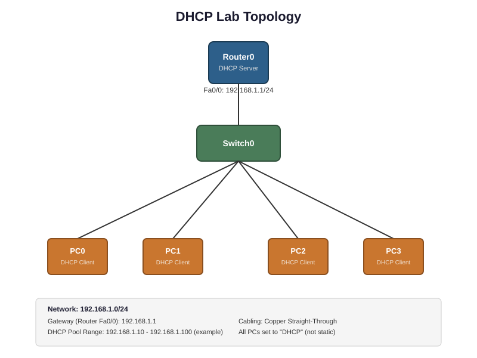

# DHCP Lab — Cisco Router as DHCP Server

## What this lab is about
I set up a Cisco router to act as a DHCP server for a small network, then connected four PCs to make sure they could all pull an IP address automatically — no manual config on the client side.

## Topology



| Device | Role | Address |
|---|---|---|
| Router0 | Gateway + DHCP Server | 192.168.1.1/24 (Gi0/0) |
| Switch0 | Connects everything | — |
| PC0–PC3 | DHCP Clients | Auto-assigned (.10–.13) |

**Network:** 192.168.1.0/24
**Excluded range:** 192.168.1.1 – 192.168.1.9 (kept open for the router and any future static devices)

## What I did
1. Gave the router's LAN interface a static IP — this becomes the default gateway for the whole network
2. Built a DHCP pool with the subnet, gateway, and DNS server info
3. Excluded the router's own address (plus a small buffer) so DHCP can't accidentally hand it out to a PC
4. Set four PCs to DHCP and confirmed each one grabbed a unique, correctly-ordered IP

## Key commands

```
! Interface config (gateway)
interface gigabitethernet0/0
ip address 192.168.1.1 255.255.255.0
no shutdown

! DHCP pool
ip dhcp pool LAN-POOL
network 192.168.1.0 255.255.255.0
default-router 192.168.1.1
dns-server 8.8.8.8

! Keep DHCP from handing out the router's own address
ip dhcp excluded-address 192.168.1.1 192.168.1.9
```

## Proof it worked
`show ip dhcp binding` on the router shows four different devices, each with its own MAC address, leased in order starting at .10 (correctly skipping the excluded range):

```
IP address        Hardware address    Type
192.168.1.10      00D0.5840.C279      Automatic
192.168.1.11      0001.9671.D65C      Automatic
192.168.1.12      0001.6468.8509      Automatic
192.168.1.13      00E0.A3A8.5187      Automatic
```

## Files in this folder
- `dhcp-lab.pkt` — the actual Packet Tracer file
- `dhcp-lab-topology.svg` — topology diagram
- `docs/walkthrough.md` — full step-by-step breakdown with explanations

## Skills this covers
Router CLI configuration, DHCP (scopes, exclusions, leasing), IP addressing/subnetting, and basic network verification/troubleshooting.
